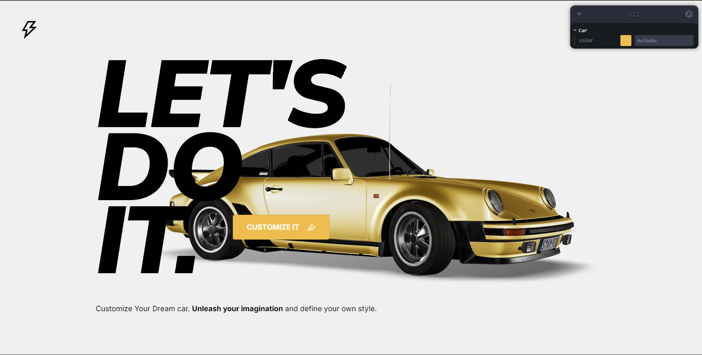

# Car Configurator

This project is a car configurator built using Three.js, a powerful JavaScript library for creating 3D graphics in the browser. With this car configurator, users can customize various aspects of a car, such as its color and wheels and see the changes in real-time.

## Features

- Interactive 3D car model
- Color customization options
- Wheel selection
- Accessories customization
- Real-time preview of changes

## Installation

1. Clone the repository: `git clone https://github.com/Manas-Kenge/Car-configurator.git`
2. Navigate to the project directory: `cd car-configurator`
3. Install dependencies: `npm install`

## Usage

1. Start the development server: `npm start`
2. Open your browser and navigate to `http://localhost:5173`
3. Use the controls provided to customize the car
4. Enjoy exploring different configurations!

